# aws-samples (Still under making...)
This repo would actually contains resources which are important for developers who are working on different
AWS services. It would provide simple samples along with few of the tutorial reference.

This goal of this article is basically utilize different popular AWS services.
Below image shows one of the sample how different AWS services actually interact with each other.

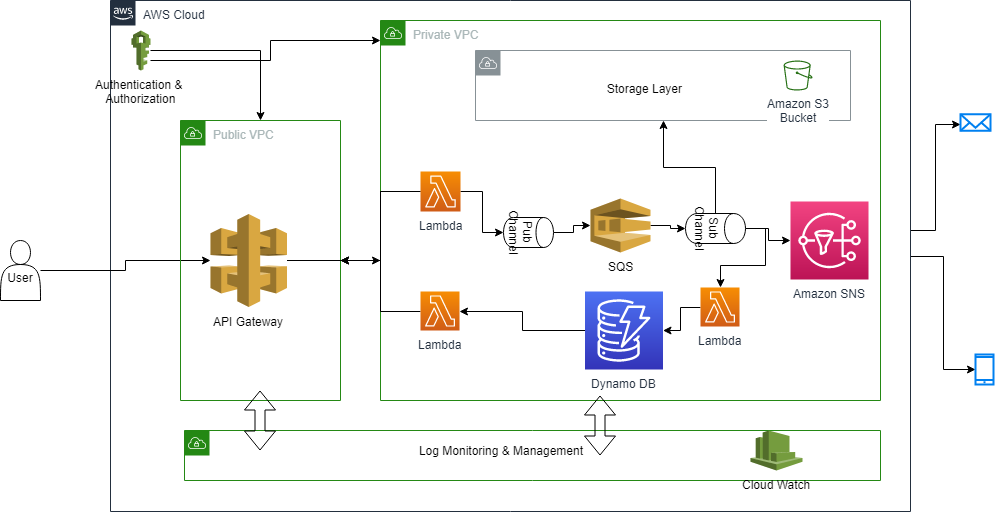

Throughout this article we would try to visit this different services and see how we can learn about them.

Before anyone get started they would possibly require one aws free subscription account.

***```AWS Subscription```***
-----------------------------
[1] - Creating account : [https://aws.amazon.com/free/start-your-free-trial/](https://aws.amazon.com/free/start-your-free-trial/)
[2] - Free service details : [https://aws.amazon.com/free/?all-free-tier.sort-by=item.additionalFields.SortRank&all-free-tier.sort-order=asc](https://aws.amazon.com/free/?all-free-tier.sort-by=item.additionalFields.SortRank&all-free-tier.sort-order=asc)

***```Library For AWS```***
--------------------------------
There are plenty of SDK, libraries available to interact with AWS. 
Boto3 - is for python. [https://aws.amazon.com/sdk-for-python/](https://aws.amazon.com/sdk-for-python/)
All the available and supported functions can be found in here - [https://boto3.amazonaws.com/v1/documentation/api/latest/reference/services/index.html](https://boto3.amazonaws.com/v1/documentation/api/latest/reference/services/index.html)
Here are the list of supported SDK(s) - [https://aws.amazon.com/getting-started/tools-sdks/](https://aws.amazon.com/getting-started/tools-sdks/)


***```[Service - 1] IAM```***
---------------------------
- Understanding IAM services : [https://www.youtube.com/watch?v=UqKWHZ36yEM](https://www.youtube.com/watch?v=UqKWHZ36yEM)
- Mastering IAM policies : [https://www.youtube.com/watch?v=YQsK4MtsELU](https://www.youtube.com/watch?v=YQsK4MtsELU)
- Troubleshooting IAM : [https://docs.aws.amazon.com/IAM/latest/UserGuide/troubleshoot.html](https://docs.aws.amazon.com/IAM/latest/UserGuide/troubleshoot.html)

***```[Service - 2] DynamoDB```*** 
-----------------------------------
As per amazon doc, 
"Amazon DynamoDB is a key-value and document database that delivers single-digit millisecond performance at any scale. 
It's a fully managed, multiregion, multimaster, durable database with built-in security, backup and restore, and in-memory caching for internet-scale applications. DynamoDB can handle more than 10 trillion requests per day 
and can support peaks of more than 20 million requests per second."

- It's a nosql popular database.
- No SQL Database : [https://www.youtube.com/watch?v=ovEq4L6tGfc](https://www.youtube.com/watch?v=ovEq4L6tGfc)
- Understanding Dynamo DB : [https://www.youtube.com/watch?v=tDqLwzQEOmM](https://www.youtube.com/watch?v=tDqLwzQEOmM)
- Tutorials : [https://martinapugliese.github.io/interacting-with-a-dynamodb-via-boto3/](https://martinapugliese.github.io/interacting-with-a-dynamodb-via-boto3/)
- With Boto3 : [https://boto3.amazonaws.com/v1/documentation/api/latest/guide/dynamodb.html](https://boto3.amazonaws.com/v1/documentation/api/latest/guide/dynamodb.html)
- In this sample created 2 table schema "Product" and "ProductCategory" and show case different set of
- For any one to use they would require to put their own "DYNAMO_DB_DEV_ACCESS_KEY_ID" and "DYNAMO_DB_DEV_SECRET_ACCESS_KEY" value.
- Attached are the sample values :

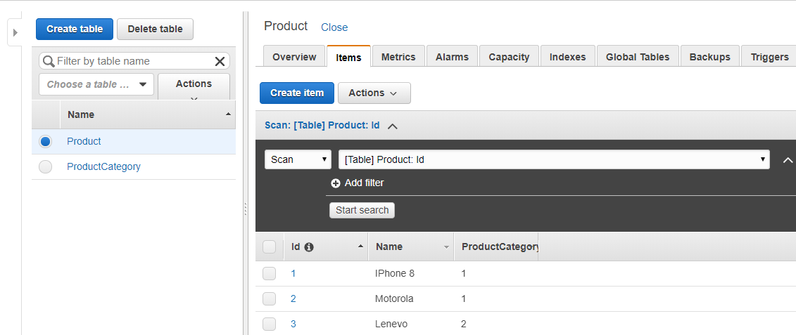
  
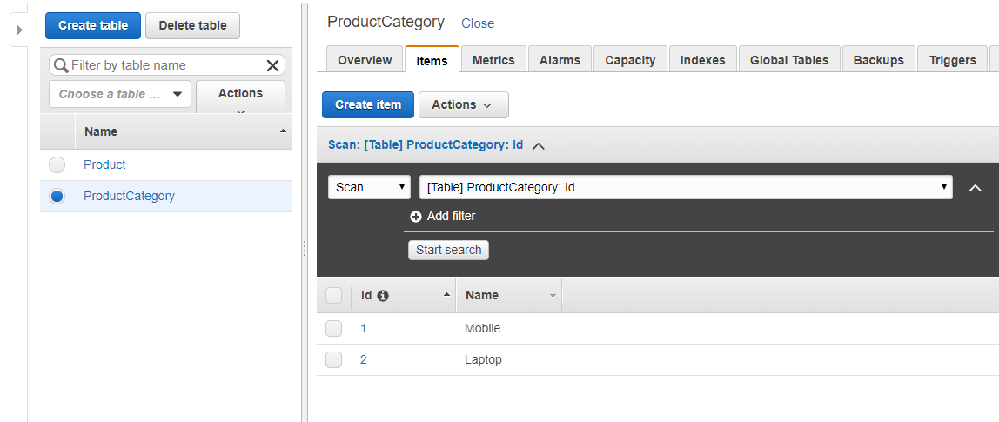


***```[Service - 3] Lambda```*** 
-----------------------------------
- Serverless architecture : https://aws.amazon.com/lambda/serverless-architectures-learn-more/
- AWS Lambda is one of the implementation of serverless framework.
- Lambda Supported Runtimes : https://docs.aws.amazon.com/lambda/latest/dg/lambda-runtimes.html
- Function should be called with "lambda_function.lambda_handler"
- [Lambda - Tutorial] - [https://aws.amazon.com/lambda/](https://aws.amazon.com/lambda/)
- [Lambda reference doc] - [https://docs.aws.amazon.com/lambda/latest/dg/welcome.html](https://docs.aws.amazon.com/lambda/latest/dg/welcome.html)
- [Ref] - [https://www.youtube.com/watch?v=XZggsCITQdY](https://www.youtube.com/watch?v=XZggsCITQdY)
 

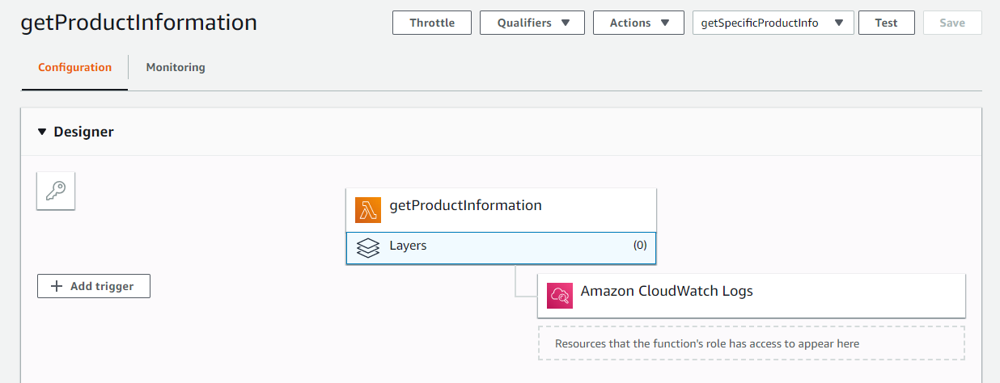

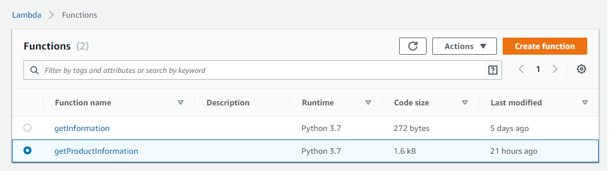

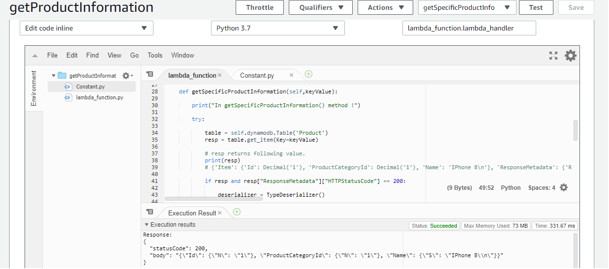

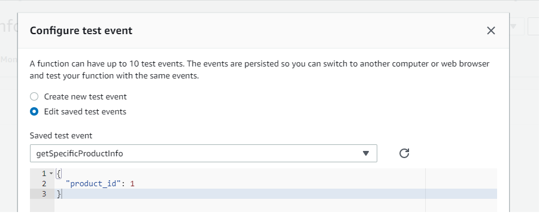

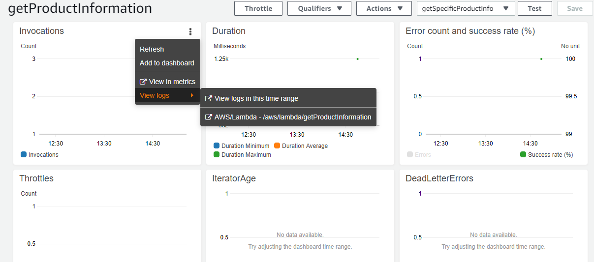

- We can configure different trigger with any lambda function 
- Below are the lambda function configuration with sample code and other details.

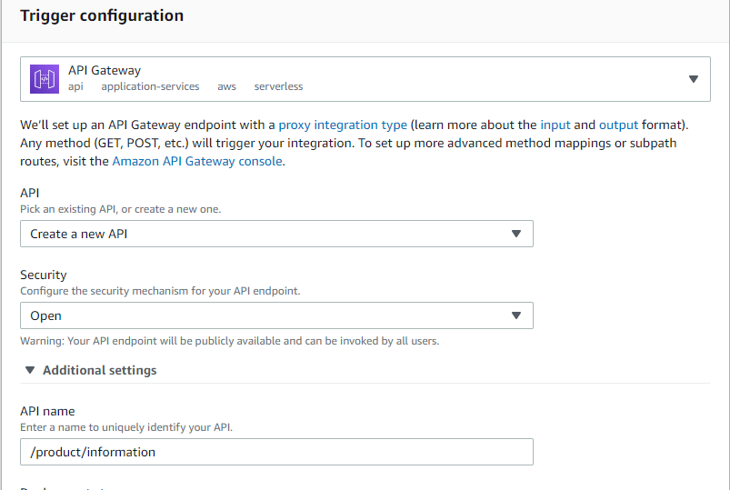

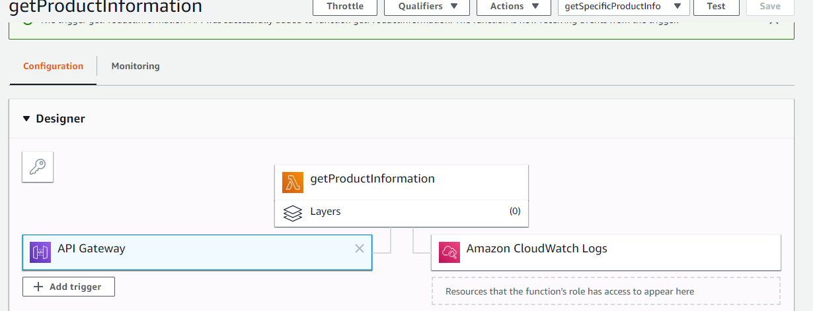

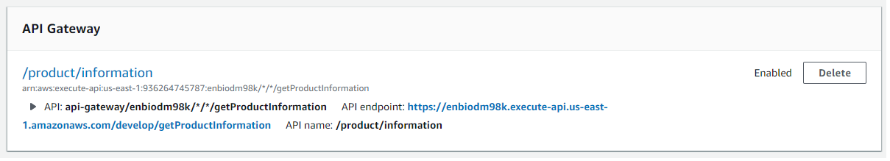


***```[Service - 4] API Gateway```*** 
-----------------------------------
- Below example shows how it can function API can be further configured and respective methods can be enabled on that.

- Configuring one "product information" API 

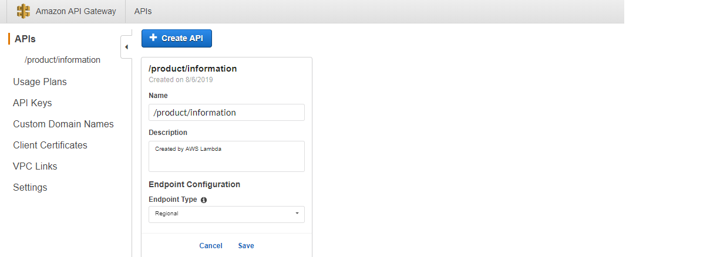

- Particularly configuring one "POST" method one REST API.

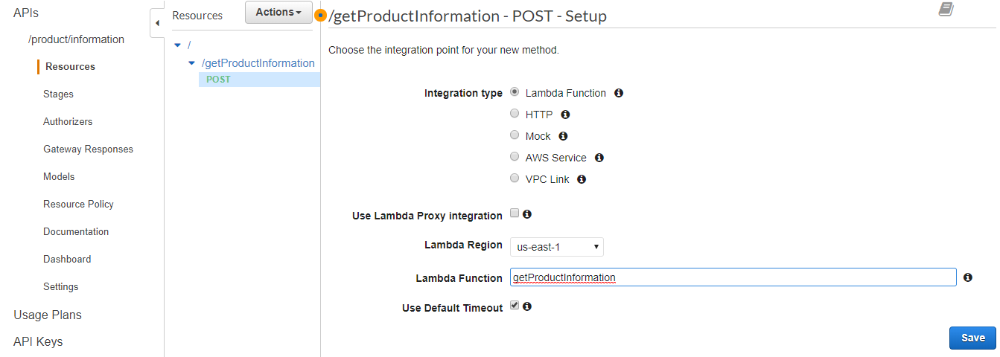

- Seeing the response of any API test call with proper tracing.

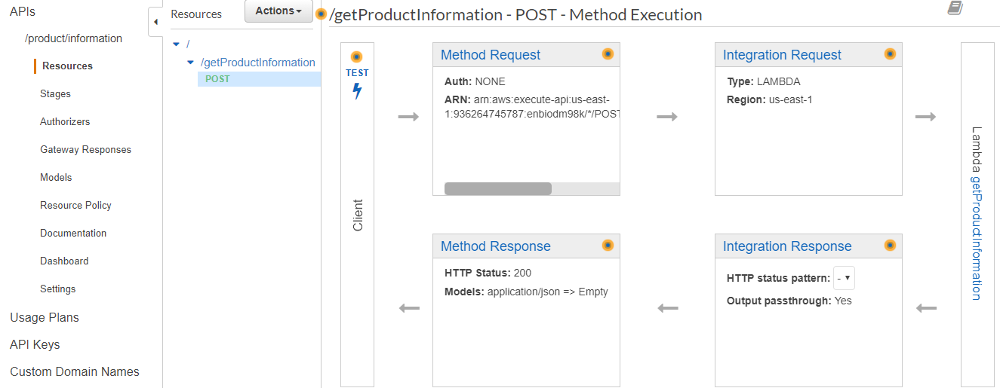

- Seeing the response of any API test call with proper tracing.

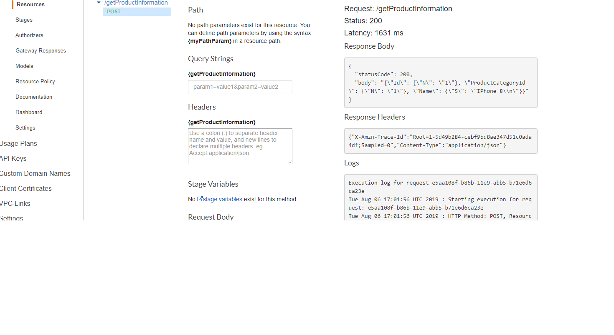

- Enabling API key for a rest API.

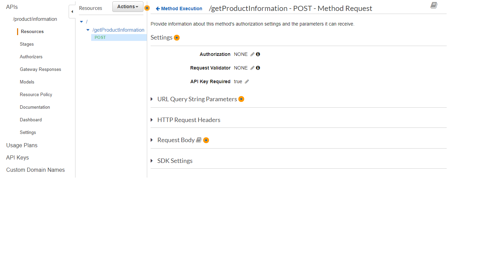

- We would also keep it in mind every time we make any changes in the API configurations we would require to deploy the API in respective staging environment.
  Be it's ***develop/qa/uat/prod***. But we can figure that out from the staging configurations.
  
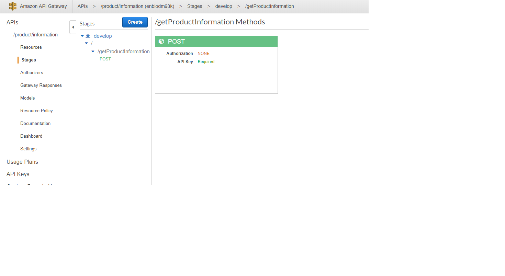   

- We would also require to set up the usage plan for individual stage and API.
- API key enablement is not enough we would require to map that against individual API level.
- Where we have options to put granular number of throttling and quotas (Could be helpful based on the subscription plan)

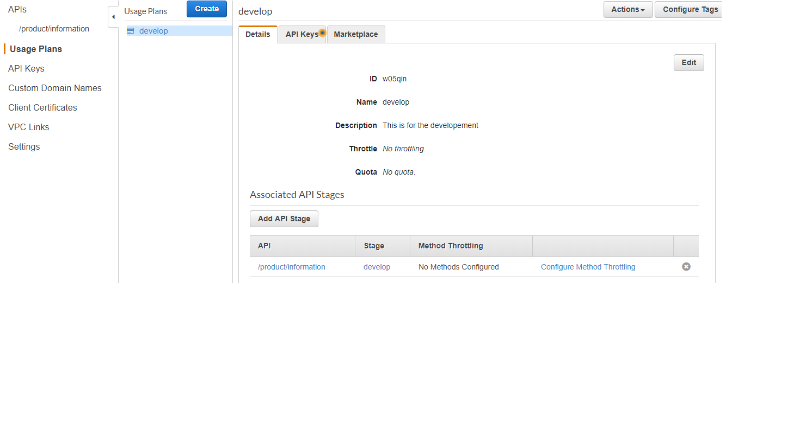

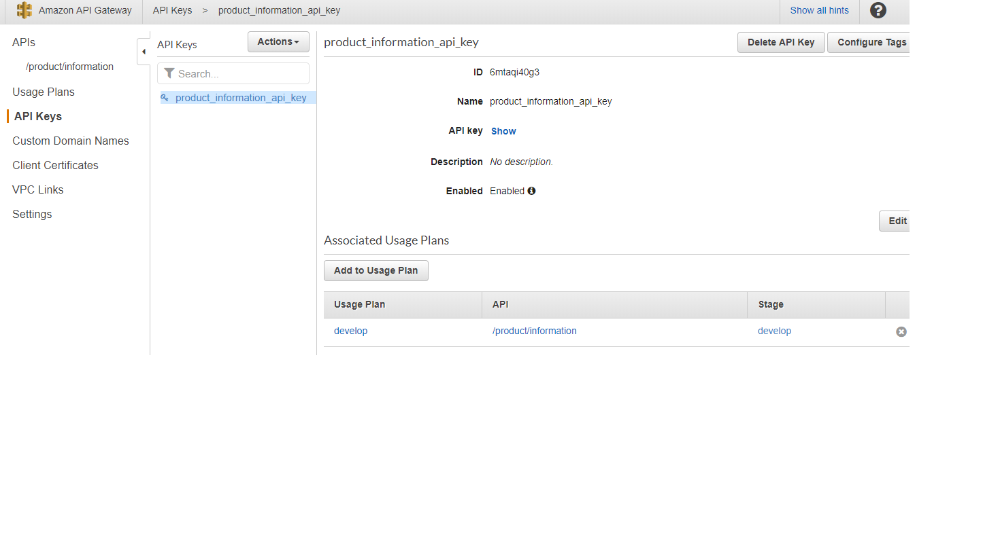

- After successful configuration we should be able to call the API with proper "x-api-key" as header token.

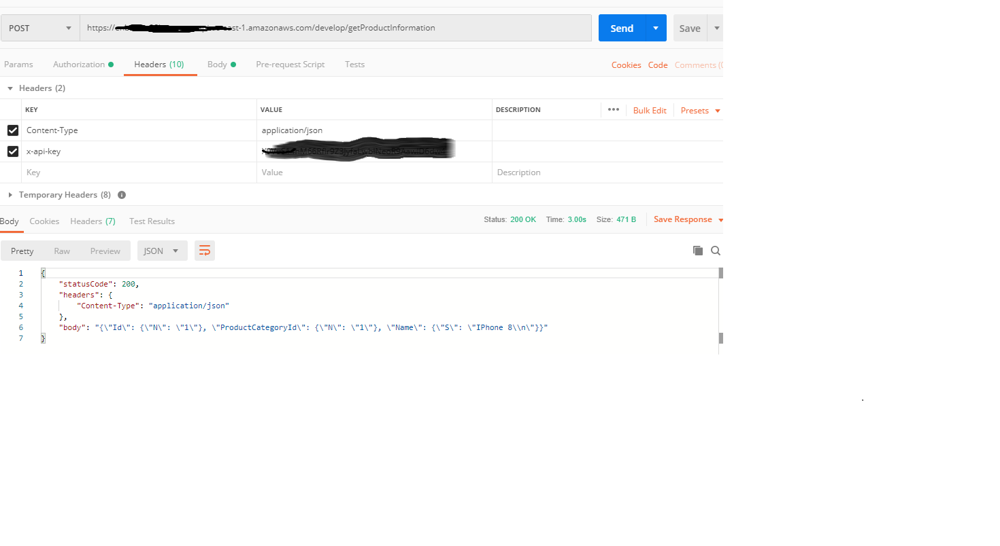

- For monitoring purpose user can also enable logging for each staging environment level.
- For each aws API services we could separately set up log/tracing. That's actually a better way of looking at it. 
  But in this scenario we could actually see the recent call with the lamnda logs itself. We could follow along with the same request correlation id everywhere. 
  
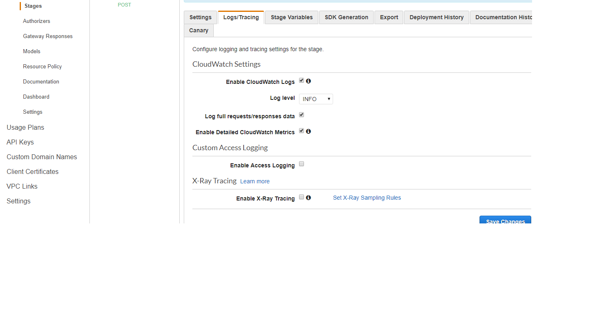

- We could also export the definition of specific API. AWS api gateway follow [Swagger](https://swagger.io/) API definitions.
- So after setting up the API through console we should be able to download the API definition as json or YAML format for future reference.
- Samples have been attached under api-gateway directory.

```References```
 
API Gateway [https://docs.aws.amazon.com/apigateway/latest/developerguide/welcome.html](https://docs.aws.amazon.com/apigateway/latest/developerguide/welcome.html)

API Gateway Tutorial : [https://www.youtube.com/watch?v=XwfpPEFHKtQ](https://www.youtube.com/watch?v=XwfpPEFHKtQ)

API Gateway With Lambda : [https://www.youtube.com/watch?v=ceVgLVXM-fs](https://www.youtube.com/watch?v=ceVgLVXM-fs)

Enabling API Key : [https://www.youtube.com/watch?v=7C3-Nf-2dS8](https://www.youtube.com/watch?v=7C3-Nf-2dS8)

Great Article On Choosing Right API Gateway Comparison : [https://www.moesif.com/blog/technical/api-gateways/How-to-Choose-The-Right-API-Gateway-For-Your-Platform-Comparison-Of-Kong-Tyk-Apigee-And-Alternatives/#](https://www.moesif.com/blog/technical/api-gateways/How-to-Choose-The-Right-API-Gateway-For-Your-Platform-Comparison-Of-Kong-Tyk-Apigee-And-Alternatives/#)

***```[Service - 5] CloudWatch Log```*** 
-----------------------------------

- Cloudwatch is self-managed service which helps to monitor and manage the logging or tracingon different services.
- CloudWatch helps to configure different logging stream on all the aws services.

- [Cloud Watch Reference] : [https://aws.amazon.com/cloudwatch/features/](https://aws.amazon.com/cloudwatch/features/) 

- Below example shows how can different aws services leverage Cloud Watch service to let the user trace any request.  
 
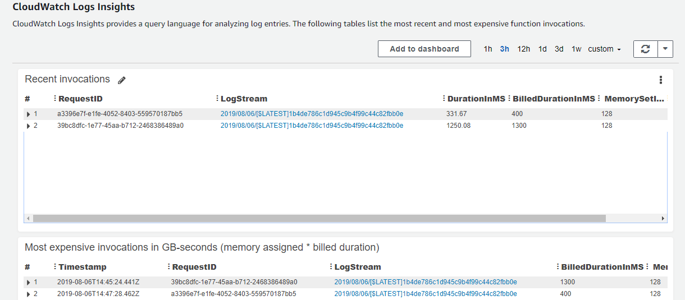

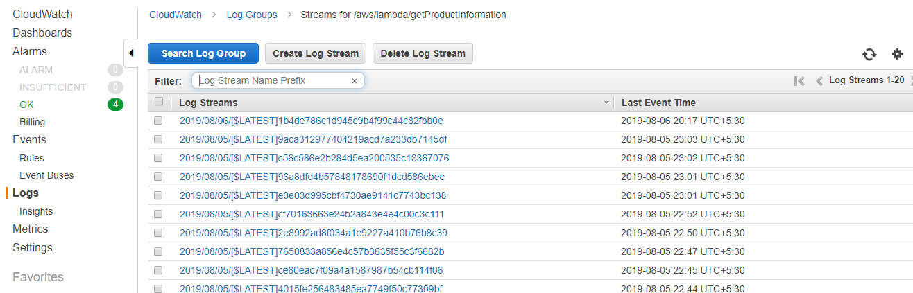

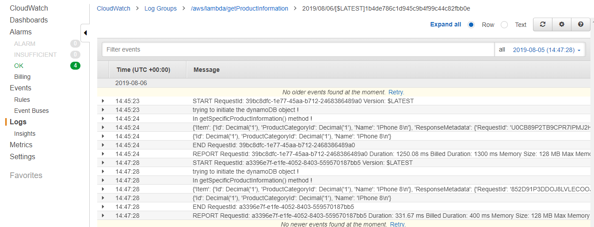


***```[Service - 6] Amazon Simple Storage Service / S3 ```*** 
-----------------------------------

***"S3"*** possibly one of the most popular service which AWS has. It's simple static storage service with very low cost.
AWS provides "aws" command line interface or different popular packages like "Boto3" which helps user to ineteract with S3 buckets programmatically.

- S3 bucket introduction : [https://docs.aws.amazon.com/AmazonS3/latest/dev/UsingBucket.html](https://docs.aws.amazon.com/AmazonS3/latest/dev/UsingBucket.html)
- Boto3 tutorial : [https://boto3.amazonaws.com/v1/documentation/api/latest/reference/services/s3.html](https://boto3.amazonaws.com/v1/documentation/api/latest/reference/services/s3.html)
- S3 bucket & IAM user : [https://www.youtube.com/watch?v=v33Kl-Kx30o](https://www.youtube.com/watch?v=v33Kl-Kx30o)

  
***```[Service - 7] Amazon Simple Queue Service / SQS ```*** 
----------------------------------------------------------
- AWS message queue service is one of the oldest service.
- This is a Pull based service, where consumer actually pull the information from queue and start process it.
- It's basically based on the concept of Publisher / Subscriber messaging model.  
- It's a form of asynchronous service-to-service communication used in serverless and microservices architecture.
- Push/Pull delivery, Schedule or Delay Delivery, At least once delivery, Exactly once delivery, Message Prioritization.
- There are 2 types of message queue available right now.
1) Standard message queue 2) FIFO queue.

Below steps shows how we can create a queue and then interact with it programmatically.

- Creating a queue and choosing one of the type.

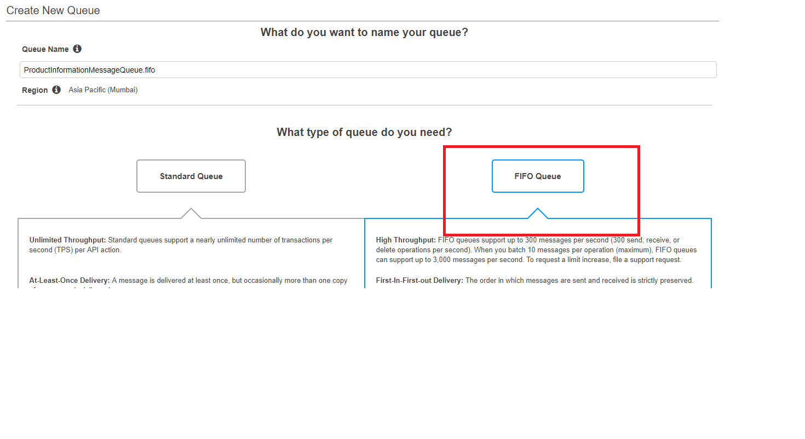

- Configuring queue if required changing default value

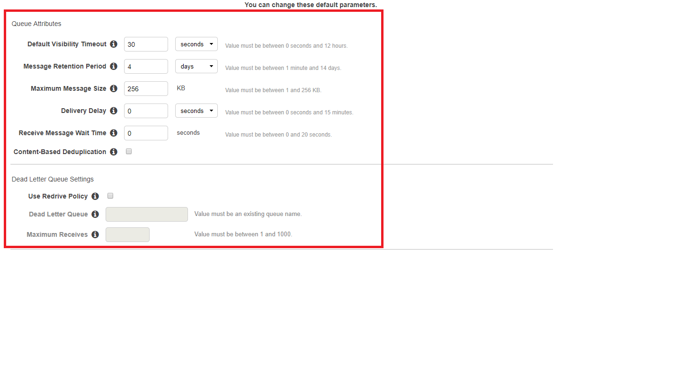

- Showing details of individual queue.

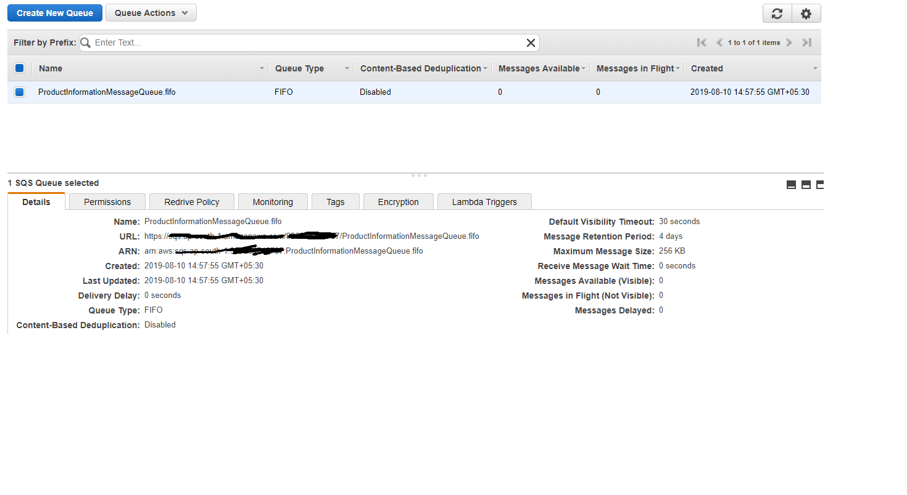

- After configuration while writing the message in the queue, we may see that it fails with following error.

- Error : "The queue should either have ContentBasedDeduplication enabled or MessageDeduplicationId provided explicitly"
- That's because of [https://stackoverflow.com/questions/28111941/sqs-delivering-a-message-only-once](https://stackoverflow.com/questions/28111941/sqs-delivering-a-message-only-once)
- So present configuration of the queue would be :

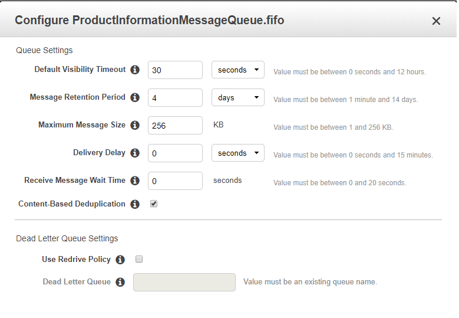

- After writing the message the queue response gives back some

```ptyhon
    {'MD5OfMessageBody': '6975ce72b39ab4196350fdc748d7997d', 'MessageId': '9882c10c-b8a3-44f1-addc-afb67a9112a6', 'SequenceNumber': '18847494785008879616', 'ResponseMetadata': {'RequestId': '347f0a4d-f113-520c-8d88-5f856dc18f57', 'HTTPStatusCode': 200, 'HTTPHeaders': {'x-amzn-requestid': '347f0a4d-f113-520c-8d88-5f856dc18f57', 'date': 'Sat, 10 Aug 2019 10:21:06 GMT', 'content-type': 'text/xml', 'content-length': '431'}, 'RetryAttempts': 0}}
```
- A complete message communication trace can be captured something like as per below. 

```python
    
    trying to initiate the SQS resource connection object !
    In writeMessageToQueue() method !
    {'MD5OfMessageBody': 'f5426f84d805284ed37f975b402c1542', 'MessageId': 'e98d31bc-9d91-4cee-b762-3ad1b2153498', 'SequenceNumber': '18847495129023983616', 'ResponseMetadata': {'RequestId': '57dde208-a7bb-5680-82ef-b7c005aa823e', 'HTTPStatusCode': 200, 'HTTPHeaders': {'x-amzn-requestid': '57dde208-a7bb-5680-82ef-b7c005aa823e', 'date': 'Sat, 10 Aug 2019 10:43:29 GMT', 'content-type': 'text/xml', 'content-length': '431'}, 'RetryAttempts': 0}}
    In readMessageFromQueue() method !
    sqs.Message(queue_url='https://ap-south-1.queue.amazonaws.com/936264745787/ProductInformationMessageQueue.fifo', receipt_handle='AQEB3NIBZMTEW6ScGE6Ygd8peqV0R9ijC5awiXmPnC/aa2nYqUrOtSLgNn1haTe+yalTgFNKAfEbcTvS3YgvqHr9gezFMmuwu99vO4XCgCgQgbK75V0KxAVfOnwg+StUKRf/ZQd84l8S9j+FC2n7NjoMv1x9rfnoflwt9MKUEDn4N4GOLlio1UT+tlMt5xqyb08BRsswVBjDcJRKz1SpcFUtAEwRbzRRMPoPcjfDFQrctuzyFO6JClzAaoG+jXnywwucpKzYJa1gEbDkDYUd3QNW+ItijsI/zBq8Sf3J92hjgrnMgQ9Of4QdWKnS7bs2UiPH')
    Message Got as an action as :: {"action": "PRODUCT_INFO_API_CALL", "data": {"product_id": 1}}
    
    Process finished with exit code 0

    
```

```References```

Message Queue : [https://aws.amazon.com/message-queue/](https://aws.amazon.com/message-queue/)
Video Tutorial : [https://www.youtube.com/watch?v=UesxWuZMZqI&feature=youtu.be](https://www.youtube.com/watch?v=UesxWuZMZqI&feature=youtu.be)
Message Queue Feature: [https://aws.amazon.com/message-queue/features/](https://aws.amazon.com/message-queue/features/)
Blog - 1 : [https://aws.amazon.com/blogs/developer/using-python-and-amazon-sqs-fifo-queues-to-preserve-message-sequencing/](https://aws.amazon.com/blogs/developer/using-python-and-amazon-sqs-fifo-queues-to-preserve-message-sequencing/)
Blog - 2 : [https://aws.amazon.com/blogs/aws/new-for-amazon-simple-queue-service-fifo-queues-with-exactly-once-delivery-deduplication/](https://aws.amazon.com/blogs/aws/new-for-amazon-simple-queue-service-fifo-queues-with-exactly-once-delivery-deduplication/)
Send Message In Queue : [https://boto3.amazonaws.com/v1/documentation/api/latest/reference/services/sqs.html#SQS.Client.send_message](https://boto3.amazonaws.com/v1/documentation/api/latest/reference/services/sqs.html#SQS.Client.send_message)
SQS Boto3 Reference : [https://boto3.amazonaws.com/v1/documentation/api/latest/reference/services/sqs.html](https://boto3.amazonaws.com/v1/documentation/api/latest/reference/services/sqs.html)

***```[Service - 8] Amazon Simple Notification Service / SNS ```*** 
----------------------------------------------------------
- This is primarily Push based service.
- It's managed messaging service that let's actually decouple publisher from subscribers.
- Where in SQS actually publish one message to the queue and subscriber pulls that to do the further processing. Where as
    in SNS through the topic actually messages gets pushed to either mobile devices or desktop devices or sends a message or even sends an email.
- Now publisher would send the message and subscriber(s) would actually delivery messages to the subscribed devices.

Below steps shows how we can configure SNS service and then interact with it programmatically.

- Configure topic for a SNS.

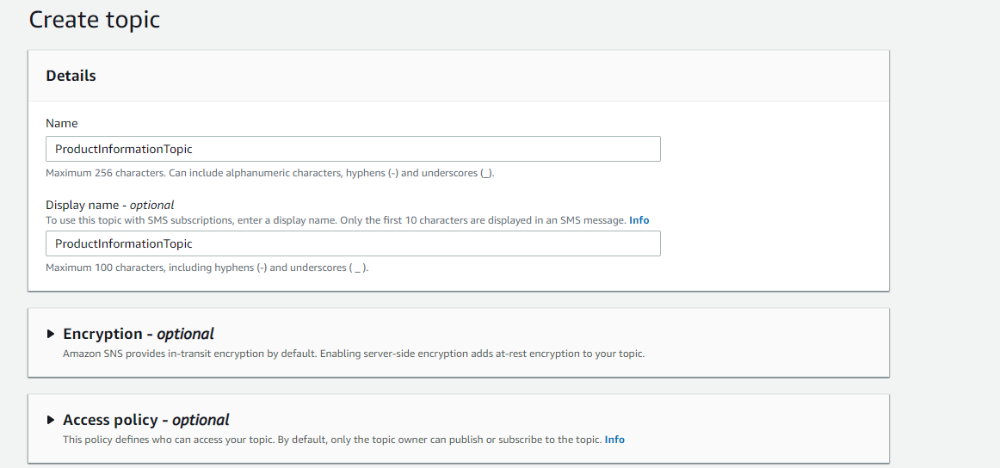

- Configure the access policy for the a topic.

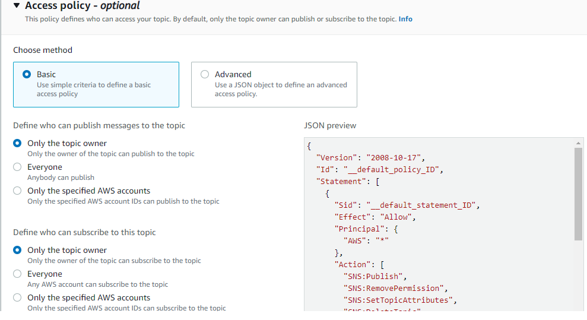

- Configure the delivery policy for the a topic.

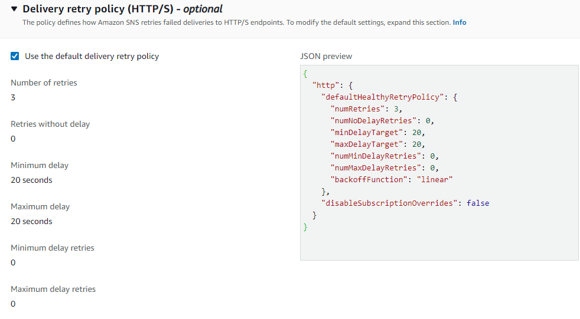

- Configure the SNS subscriber for to receive the messages. There are many protocol available, 
in this example we have chosen email as protocol.

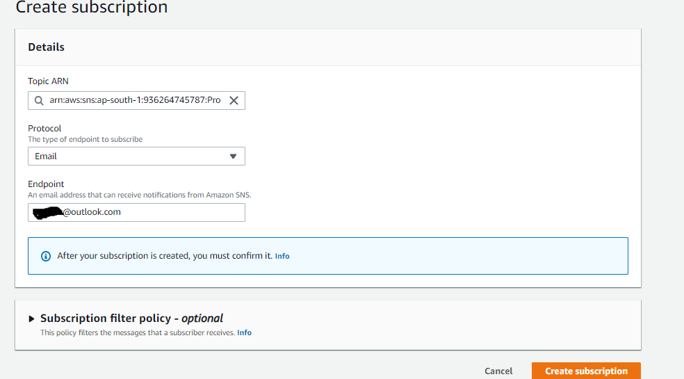

- Each individual subscriber has to confirm then only "Pending Confirmation" would get away from the topic configuration page.

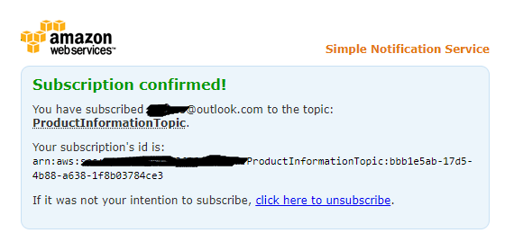

- Below configuration details can be seen again.
 
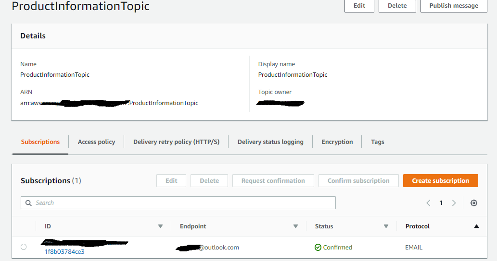

- While looking into the Boto3 documentation I could see that low level "client" seems to be much more prominent.
- So in our code example we have actually dealt with client API more.
- Below is the trace.

```python
    
    trying to initiate the connection with SNS topic !
    In publishMessageToTopic() method !
    {'MessageId': 'e55b26b9-2364-5b5d-9e07-7371c8b09091', 'ResponseMetadata': {'RequestId': '16614d1c-6af9-5de8-891d-18d4812d1624', 'HTTPStatusCode': 200, 'HTTPHeaders': {'x-amzn-requestid': '16614d1c-6af9-5de8-891d-18d4812d1624', 'content-type': 'text/xml', 'content-length': '294', 'date': 'Sat, 10 Aug 2019 15:58:12 GMT'}, 'RetryAttempts': 0}}

```

- We would just need to make sure that message gets published into the topic. Rest SNS service takes care pushing that message to the respective subscriber.

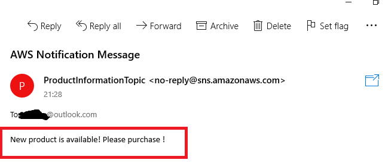
   

```References```
- Setting up access for SNS : [https://docs.aws.amazon.com/sns/latest/dg/sns-setting-up.html](https://docs.aws.amazon.com/sns/latest/dg/sns-setting-up.html)
- SNS : [https://docs.aws.amazon.com/sns/latest/dg/sns-getting-started.html](https://docs.aws.amazon.com/sns/latest/dg/sns-getting-started.html)
- SNS - quick guide : [https://www.youtube.com/watch?v=sIBUqxnOGQQ](https://www.youtube.com/watch?v=sIBUqxnOGQQ)
- SNS - Email Subscriber : [https://www.youtube.com/watch?v=YC-sVSbeowA](https://www.youtube.com/watch?v=YC-sVSbeowA) 
- Pub & Sub : [https://www.youtube.com/watch?v=c_WNBmEc6EE](https://www.youtube.com/watch?v=c_WNBmEc6EE)
- Blog - 1 : [https://bradmontgomery.net/blog/sending-sms-messages-amazon-sns-and-python/](https://bradmontgomery.net/blog/sending-sms-messages-amazon-sns-and-python/) 

***```[Service - 9] Cognito```*** 
-----------------------------------
- It's one of the popular services which provides identity to developed of the applications.
- It provides identity token for authentication of a user and also handles entire authorization process for any applications.
- We have emerged from -- > Storing Simple Password to --> Hash Based Password Storing --> Salt Hash based password storing --->
not storing any password using [SRP protocol](https://en.wikipedia.org/wiki/Secure_Remote_Password_protocol)
And when we talked about managing different user groups or pools or managing their identities with large number of users at scale. Then cognito might be
a great choice. A simple flow how a aws Cognito can authenticate one user request could be something like as per below.

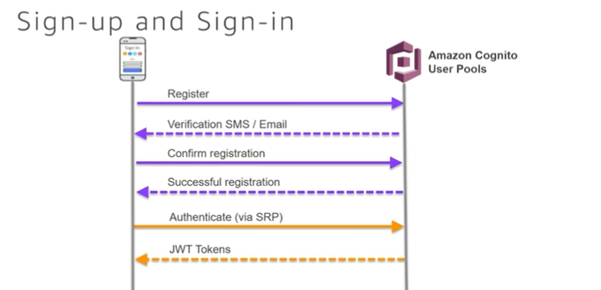

For some of the application if it's required to do custom verification then in that scenario we may use below flow with Cognito and AWS lambda.

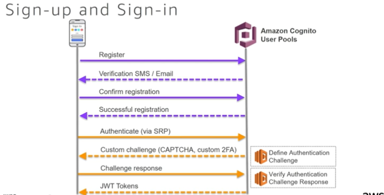

Image Sources : https://www.youtube.com/watch?v=VZqG7HjT2AQ&t=2882s

- Let's understand one of the different which seems to be bit confusing. If I have IAM service to authorize different user for different 
aws services. Then why should I be bother to incorporate my Cognito pool information along with IAM (identity access management). 
Below flow would help to understand that. We know that from Cognito user pool we would authenticate the user after accessing JWT token. With that token we would go to the Cognito Fedaration Identity pool 
to get the access key and secret token for any of the aws managed services to use (Like S3 or aws Lambda).

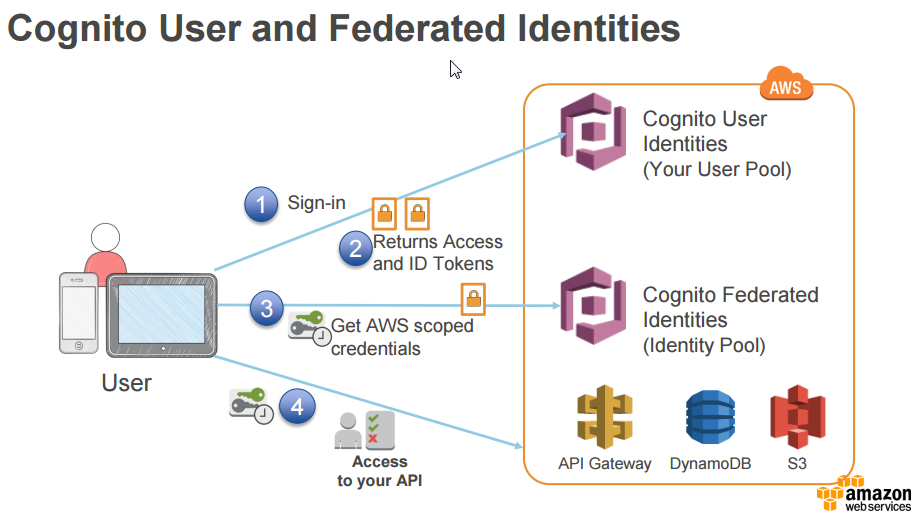

Image Source : http://blog.jacobmarks.com/2016/12/amazon-cognito-user-pool-admin.html


Below set of steps actually shows how to configure a User Pool in Cognito and manage to interact with it.

- Choosing the correct name of the User Pool.
 
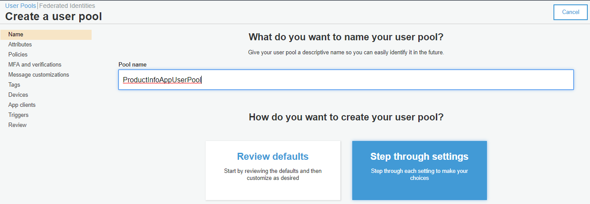

- Setting up the correct set of attributes of the UserPool.

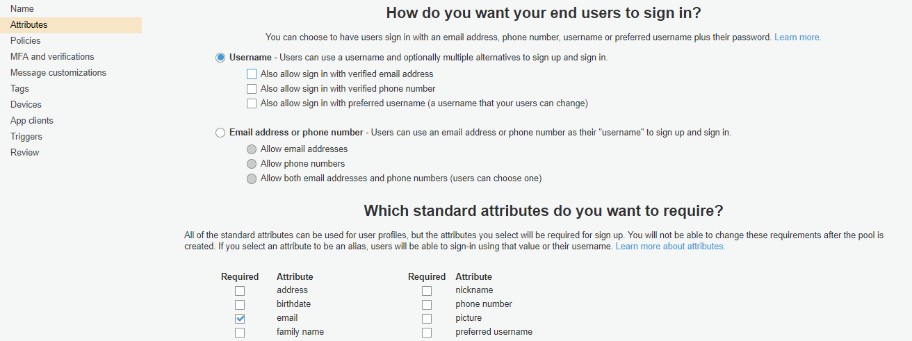

- User also need to set up the password policies.

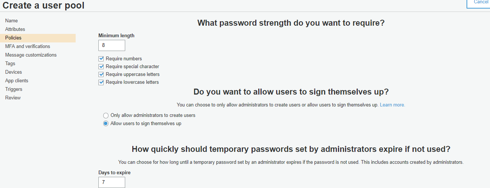

- Further attributes can be set it up pretty easily. 

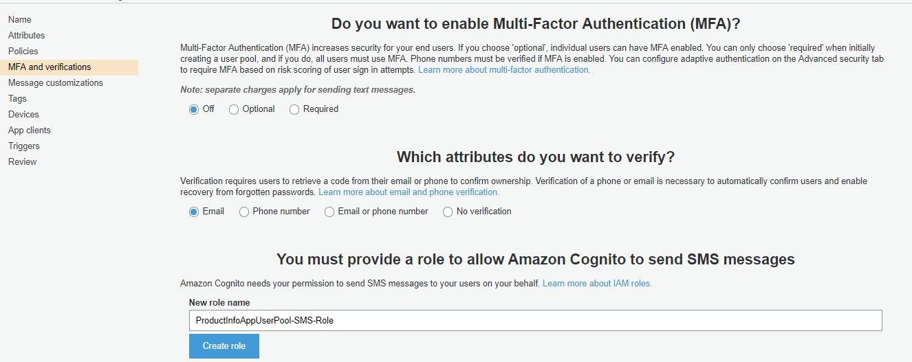

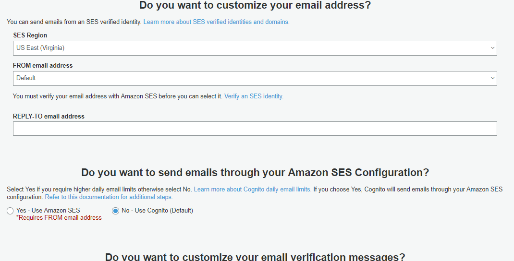

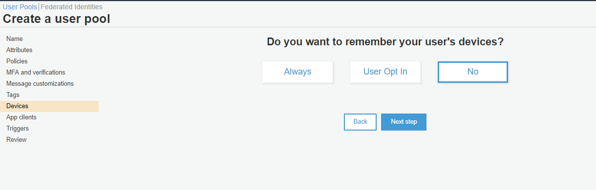

- And then need to define which client would have an access to this Cognito User Pool.
 
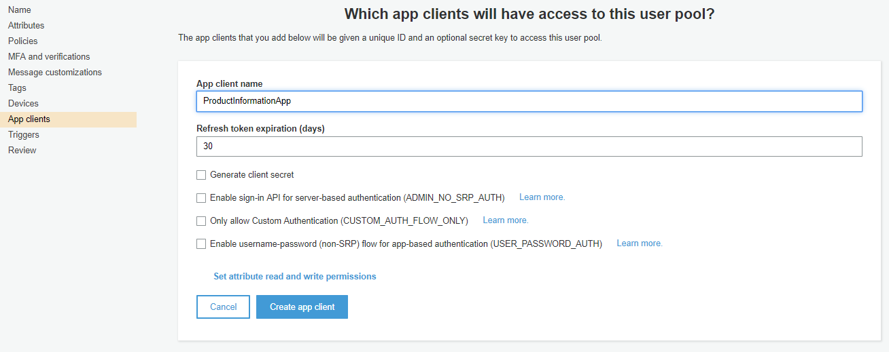

- Before submitting we would require to review the details.

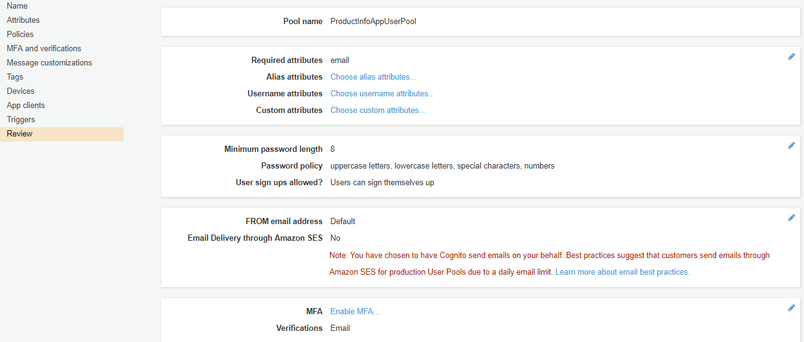

- User has to note down the User Pool Id along with other details for further using in their applications.  


```References```
- https://aws.amazon.com/cognito/
- Explaination with UI : Part-1: [https://www.youtube.com/watch?v=EaDMG4amEfk](https://www.youtube.com/watch?v=EaDMG4amEfk)
- Authentication with Cognito : [https://www.integralist.co.uk/posts/cognito/](https://www.integralist.co.uk/posts/cognito/) 
- Authentication serverless : [https://www.youtube.com/watch?v=VZqG7HjT2AQ&t=2882s](https://www.youtube.com/watch?v=VZqG7HjT2AQ&t=2882s)


***```[Service - 10] Cloud9 IDE```*** 
-----------------------------------

